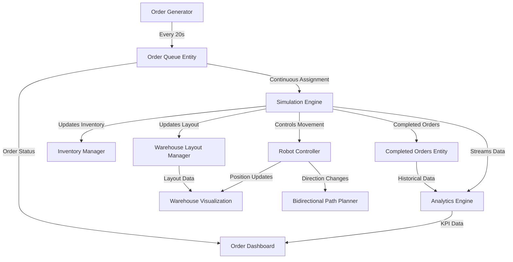

# 🤖 E-Commerce Warehouse Robot Simulation - System Design Document

**Version:** 1.2
**Date:** July 8, 2025
**Project Type:** Single Robot Warehouse Simulation with Bidirectional Snake Path Navigation

---

## 📌 Project Overview

### 🌟 Primary Goal

Build a real-time simulation of a warehouse robot system for e-commerce fulfillment using synthetic data generation and performance analytics. This simulation replicates the movement and order fulfillment behavior of Autonomous Mobile Robots (AMRs) in a 25x20 warehouse grid, using an optimized bidirectional snake path strategy.

### 🏢 Business Context

* **Target Environment:** Large-scale e-commerce warehouse
* **Scale:** 25 aisles × 20 racks (500 total storage locations)
* **Order Rate:** New order generated every 20 seconds
* **Robot Fleet:** Single robot (Phase 1); scalable for multi-robot environments
* **Objective:** Generate high-fidelity data for algorithm testing and operational improvements

---

## 🏗️ System Architecture

### ⚙️ Core Components

#### Simulation Engine

* Real-time movement with interpolation
* Bidirectional snake path with reverse movement
* Accelerated time simulation (15-20s per aisle)
* Event-driven, modular framework

#### Warehouse Layout Manager

* 25x20 warehouse grid
* Snake-pattern layout with forward/reverse navigation
* Dynamic item positioning with live inventory sync
* Unified base and packout location

#### Robot Controller

* State machine: `IDLE → MOVING → COLLECTING → RETURNING`
* Movement physics and path interpolation
* Dynamic direction switching based on distance optimization
* Extensible architecture for collision detection (multi-robot support)

#### Order Management System

* Auto-generation every 20 seconds
* Max 4 items per order
* Continuous order assignment to available robot
* Guaranteed completion logic

#### Inventory Management System

* Item-level tracking across 500 unique locations
* Real-time updates on order completion
* Stock check to prevent overselling

#### Analytics Engine

* KPI tracking in real time
* Metrics on movement, efficiency, and direction changes
* CSV/JSON data export

#### Dual-Window Interface

* **Warehouse View:** Real-time robot movement with direction overlays
* **Dashboard View:** Order status, KPIs, robot states

---

## 📺 Architecture Diagram



---

## 🔧 Technology Stack

| Layer            | Technology             | Purpose                             |
| ---------------- | ---------------------- | ----------------------------------- |
| Backend          | Python                 | Simulation logic & state management |
| Frontend         | React + Canvas/WebGL   | Real-time UI visualization          |
| State Management | Python Dictionaries    | In-memory state of robot and orders |
| Configuration    | YAML/JSON              | Layout and parameters configuration |
| Data Export      | CSV/JSON               | KPI and performance metrics export  |
| Time Management  | Custom Controller      | Simulation time acceleration        |
| Path Planning    | Custom Snake Algorithm | Optimized bidirectional navigation  |

---

## 📁 Data Models

### 📅 Order Queue Entity (Active Orders)

```python
{
  "order_id": "ORD_20250708_001",
  "item_ids": ["ITEM_A1", "ITEM_B3", "ITEM_C7"],
  "timestamp_received": "2025-07-08T14:50:00Z",
  "status": "IN_PROGRESS",
  "assigned_robot_id": "ROBOT_001"
}
```

### 🕛 Completed Orders Entity

```python
{
  "order_id": "ORD_20250708_001",
  "timestamp_completed": "2025-07-08T14:52:45Z",
  "total_distance_traveled": 450.5,
  "efficiency_score": 0.85,
  "direction_changes": 2,
  "path_optimization_savings": 125.3
  "Total time taken": 34
}
```

### 🧷 Robot Entity

```python
{
  "robot_id": "ROBOT_001",
  "current_position": {"aisle": 12, "rack": 8},
  "target_location": {"aisle": 10, "rack": 15},
  "movement_direction": "REVERSE",
  "status": "COLLECTING",
  "items_held": ["ITEM_A1", "ITEM_B3"],
  "target_items": ["ITEM_C7"],
  "snake_path_segment": "AISLE_12_LEFT_TO_RIGHT"
}
```

### 📂 Inventory Item

```python
{
  "item_id": "ITEM_A1",
  "location": {"aisle": 1, "rack": 5},
  "quantity": 97
}
```

---

## 🔄 Dynamic Workflow

### 1. Continuous Order Assignment

* Robot status monitored
* Auto-assign next order if IDLE
* Order directly transitions to IN\_PROGRESS
* No idle time between orders

### 2. Bidirectional Snake Path Navigation

* Direction chosen based on shortest path
* Maintains snake-pattern integrity
* Forward/reverse transitions optimized per item position

### 3. Real-Time Inventory Management

* Inventory updated atomically upon order completion
* Prevents overselling

---

## 🛂 Bidirectional Path Planning

### Movement Rules

* Odd aisles: Left → Right
* Even aisles: Right → Left
* Reverse supported for optimal navigation

### Benefits

* Travel time reduction
* Direction-aware path optimization
* More realistic simulation dynamics

---

## 📊 Key Performance Indicators

### Real-Time KPIs

* Robot location, direction
* Held vs. target items
* Distance traveled
* Direction changes

### Historical KPIs

* Completion time
* Path optimization savings
* Robot utilization
* Inventory turnover

### System Metrics

* Avg. order cycle time
* Warehouse efficiency
* Snake path effectiveness

---

## 🏭 Warehouse Layout

### Grid Specs

* Dimensions: 25 aisles × 20 racks
* 500 storage points
* Snake navigation with interpolation

### Zones

* Base/Packout: Aisle 0, Rack 0
* Transit paths: All aisles
* Navigation obeys warehouse bounds

### Timing

* Aisle traversal: 15-20 seconds (sim time)
* 3-4x accelerated relative to real-world

---

## 🎮 User Interface

### Warehouse View

* Real-time robot position
* Movement direction arrows
* Target path overlay
* Item pickup locations highlighted

### Order Dashboard

* Live metrics
* Order assignment table
* Robot status panel
* KPI charts and export tools

---

## 🛠️ Development Guidelines

### Core Principles

* Complete each phase fully before next
* Modular components for scalability
* Accurate real-time and historical data

### Technical Standards

* Well-documented and tested
* Performance profiling built-in
* Exception-safe logic
* Configurable parameters

### Future-Proofing

* Multi-robot architecture support
* Collision detection ready
* Advanced optimization algorithms extendable

---

**End of Document**
